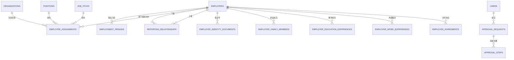

# HR 系统第一版字段结构

> 本文是字段与数据关系的设计说明。数据库模型以 [`backend/prisma/schema.prisma`](../backend/prisma/schema.prisma) 为准，PostgreSQL 变更以 [`backend/prisma/migrations`](../backend/prisma/migrations) 中按时间顺序执行的 migration 历史为准。

## 1. 本阶段范围

本阶段采用“结构先行”：

- 已建立第一版 Prisma/PostgreSQL 表、字段、索引和外键。
- 已为旧员工数据设计任职周期、主要任职和主要身份证件的迁移回填。
- 尚未为所有新表开发后端 API 和前端功能页。
- 现有免数据库 Demo 继续使用原来的精简字段，不要求承载本文件中的全部新字段。
- 只有 PostgreSQL 迁移实际执行后，新结构才会出现在数据库中；仅修改 Prisma 文件不会自动修改数据库。

## 2. 数据设计规则

1. `employees` 表示自然人的长期档案。重新入职沿用原档案和原工号。
2. 一名员工可以在不同时间拥有多段部门任职历史，但同一时点不得同时属于多个部门；同一时点最多一个主要上级且可以为空，并可按业务配置其他类型的汇报关系；员工可以拥有多种证件和多段入职经历。
3. 中心、部门等组织使用 `parent_id` 组成不限层级的组织树。
4. 部门、岗位、固定职级 code、职务、上级、人员类别、雇佣关系、用工形式和合同变化保留历史。
5. 人员类别、人员来源、雇佣关系和用工形式是独立字段；雇佣关系取内部员工、实习生和劳务人员，共用员工主档案。
6. 正式业务数据使用停用、撤销或归档，不直接物理删除。
7. 部门权限覆盖本部门及所有下级组织；项目仅供 HR 使用，不另设字段级读取权限。
8. 岗位和职务使用独立目录；职级使用固定 `JobLevelCode` enum，未来如需调整必须通过新迁移。

## 3. 核心关系图

## 4. 通用字段约定

| 字段 | 用途 | 规则 |
| --- | --- | --- |
| `id` | 每条记录自己的主键 | 不同表的主键不要求相同 |
| `employee_id` | 指向员工主档案 | 外键关联 `employees.id` |
| `organization_id` | 指向组织节点 | 外键关联 `organizations.id` |
| `status` | 按所属模型使用具体 Enum | 例如 `RecordStatus`、`AssignmentStatus`、`EmploymentStatus`；停用后不再用于新业务选择 |
| `start_date` / `effective_date` | 记录开始生效时间 | 历史关系必须保存 |
| `end_date` / `expiry_date` | 记录结束时间 | 当前有效记录通常为空 |
| `archived_at` | 归档时间 | 归档后仍可查询历史 |
| `created_at` / `updated_at` | 创建和修改时间 | 由系统维护 |

本系统当前仅供 HR 使用，数据库字段不按敏感级别划分独立读取权限。有可靠来源的字段在员工读取权限和组织数据范围内正常展示；附件下载、写操作和审计仍按各自业务接口控制。

## 5. 核心人员、组织与任职

### 5.1 `employees`：员工长期主档案

| 字段 | 类型 | 必填 | 规则/说明 |
| --- | --- | --- | --- |
| `id` | String | 是 | 内部主键 |
| `employee_no` | String | 是 | 全系统唯一；重新入职沿用；离职后不可复用 |
| `name` | String? | 完整新增是；导入否 | 当前姓名；导入待完善人员可为空，页面显示 `--` |
| `former_name` | String | 否 | 曾用名 |
| `english_name` | String | 否 | 英文名 |
| `gender` | Enum (`Gender`) | 否（新增必填） | 男、女、保密 |
| `birth_date` | Date | 否 | 出生日期 |
| `nationality` | String | 否 | 国籍 |
| `ethnicity` | Enum (`Ethnicity`) | 否 | 民族；取 Prisma `Ethnicity` 枚举值 |
| `native_place` | String | 否 | 籍贯详细说明；历史自由文本保持原值，不自动拆分 |
| `native_place_region_code` | VarChar(12) | 否 | 籍贯所选 GB/T 2260 兼容行政区划代码；由共享静态目录校验 |
| `political_status` | Enum (`PoliticalStatus`) | 否 | 政治面貌；取 Prisma `PoliticalStatus` 枚举值 |
| `marital_status` | Enum (`MaritalStatus`) | 否 | 婚姻状况；取 Prisma `MaritalStatus` 枚举值 |
| `mobile` | String? | 完整新增是；导入否 | 当前兼容 API 使用；导入待完善人员可为空，页面显示 `--` |
| `personal_email` | String | 否 | 个人邮箱 |
| `work_email` | String | 否 | 工作邮箱 |
| `household_type` | Enum (`HouseholdType`) | 否 | 户口类别；取 Prisma `HouseholdType` 枚举值 |
| `household_region_code` | VarChar(12) | 否 | 户籍所在地所选 GB/T 2260 兼容行政区划代码 |
| `household_address` | Text | 否 | 户籍详细地址；历史自由文本保持原值，不自动拆分 |
| `residential_region_code` | VarChar(12) | 否 | 联系地址所选 GB/T 2260 兼容行政区划代码 |
| `residential_address` | Text | 否 | 联系详细地址；历史自由文本保持原值，不自动拆分 |
| `bank_name` | Enum (`BankName`) | 否 | 银行名称；当前 Prisma 仅确认 `ICBC` |
| `bank_branch_name` | String | 否 | 开户行支行 |
| `bank_account_number` | VarChar(19) | 否 | 银行账号 |
| `profile_photo_id` | String | 否 | 关联头像附件 |
| `record_status` | Enum (`RecordStatus`) | 是 | 档案有效、停用或归档；人员类别、雇佣关系和用工形式不放在员工主档案中 |
| `archived_at/by/reason` | Date/User/Text | 否 | 归档审计信息 |
| `id_card_no` | String? | 兼容 | 仅当前主要证件为居民身份证时同步；其他证件号码只保存在证件表 |
| `organization_id` | String? | 兼容 | 旧 API 使用；目标结构改用任职表。导入创建的待完善人员可暂缺该字段，不代表存在部门任职；后续同工号导入同时提供完整任职字段时，会补建首段任职并同步该字段。 |

### 5.2 `organizations`：中心和部门组织树

| 字段 | 类型 | 必填 | 规则/说明 |
| --- | --- | --- | --- |
| `code` / `name` | String | 是 | 组织编码唯一，名称可重复 |
| `parent_id` | String | 否 | 指向上级组织，形成不限层级树；当前测试目录为四层：上海宜信电子商务有限公司、CEO/董事长负责人分组、部门/业务组、团队；不使用固定组织类型枚举。无冒号的复合名称按原文作为一个节点。|
| `sort_order` | Int | 是 | 同级排序 |
| `effective_date` / `expiry_date` | Date | 否 | 组织有效期 |
| `status` / `archived_at` | Enum (`RecordStatus`)/Date | 是/否 | 正式业务组织停用或归档，不删除历史组织；当前仅为测试数据的旧组织可由受保护的测试目录替换脚本直接删除 |
| `description` | Text | 否 | 组织说明 |

### 5.3 基础目录表

| 表 | 主要字段 | 用途 |
| --- | --- | --- |
| `positions` | code、name、organization_id、category、status、archived_at | 公司内部职位目录；当前以用户提供的 434 条五位编号/名称为唯一标准。每个编号独立，即使名称相同也不合并；新业务选择只使用有效、未归档项。 |
| `employee_identity_documents` | document_type、document_number、is_primary、expiry_date、status | 证件类型使用用户确认的 60 项 `IdentityDocumentType`；只有 `NATIONAL_ID` 同步迁移期 `employees.id_card_no`，其余证件号码仅保存在规范证件记录。 |
| `employee_assignments.job_level` | `JobLevelCode` enum | 固定职级 code：`S1`–`S7`、`E1`–`E7`、`T1`–`T7`、`M1`–`M7`；通过新迁移从旧目录精确回填 |
| `employing_companies` | code、name、status | 全日制公司目录；仅内部合同协议通过该目录关联，不写入部门任职；外部履历和项目经历的公司文字字段保持原语义 |
| `job_titles` | code、name、organization_id、status | 职务，例如部门经理 |
| `workplaces` | code、name、address、status | 工作地点 |

### 5.4 `employment_periods`：入职/离职周期

| 字段 | 类型 | 必填 | 规则/说明 |
| --- | --- | --- | --- |
| `employee_id` | String | 是 | 始终关联同一员工主档案 |
| `sequence_no` | Int | 是 | 同一员工第几段任职，联合唯一 |
| `personnel_category` | Enum (`PersonnelCategory`) | 否 | 本段任职的人员类别，例如创英计划/非创英计划 |
| `personnel_source` | Enum (`PersonnelSource`) | 否 | 本段任职的人员来源 |
| `employment_relationship` | Enum (`EmploymentRelationship`) | 是 | 雇佣关系：内部员工、实习生或劳务人员 |
| `entry_date` | Date | 是 | 本次入职日期 |
| `planned_exit_date` / `actual_exit_date` | Date | 否 | 计划和实际离职日期 |
| `employment_status` | Enum (`EmploymentStatus`) | 是 | 试用、正式、待入职、调出、待调入、退休、离职或非正式 |
| `is_rehire` | Boolean | 是 | 是否重新入职 |
| `previous_period_id` | String | 否 | 指向上一段任职周期 |
| `exit_reason` | Text | 否 | 离职原因 |

### 5.5 `employee_assignments`：部门任职历史

人员页面的部门任职记录包含人员定位、固定职级、员工层级、人员类别、雇佣关系、人员来源和六类用工形式；不再存储全日制公司。人员定位为固定 `PersonnelPosition` enum（`FRONT_OFFICE`、`MIDDLE_OFFICE`、`BACK_OFFICE`），职级为固定 `JobLevelCode` enum（`S1`–`S7`、`E1`–`E7`、`T1`–`T7`、`M1`–`M7`），员工层级为固定 `EmployeeLevel` enum（`STAFF`、`SUPERVISOR`、`MANAGER`、`DIRECTOR`、`PRESIDENT`、`EXPERT`）；三者直接保存为每条 `EmployeeAssignment` 的当时 code，不使用可维护目录。全日制公司改由 `EmployeeAgreement.employingCompany` 关联独立目录并随协议保留历史；人员列表和详情从当前任职周期的当前有效协议读取目录 `name`，没有可确认协议或目录关系时返回 `null` 并显示 `--`。用户确认人员定位、员工层级、人员类别、雇佣关系、人员来源和用工形式可在人员编辑页直接更新当前主要任职，并通过 `employee_field_change_logs` 保存 stable code 和中文标签快照；全日制公司须通过合同协议业务流程维护。人员编辑页允许直接变更部门：服务端以本次 UTC 日历日结束旧主要任职、创建继承岗位/职级/职务/地点及其余任职快照的新主要任职，并同步迁移期 `employees.organization_id` 与组织目录值日志；部门变更不自动修改职位。部门、岗位、职级、地点和状态等原有历史字段仍遵循结束旧记录、新建历史记录的规则。

员工主档增加户口类别及单账户银行信息；人员列表和详情直接读取这些主档字段，未录入时返回 `null` 并显示 `--`。最高教育记录采用固定最高学历和院校类型枚举，人员列表和详情从有效教育记录中优先读取标记为最高学历的记录。人员页面与人员子集页面没有接口或表格依赖，只按同一底层记录各自查询。员工名册是独立的 PostgreSQL 组合查询：当前实现不读取户口类别、人员来源、银行字段或院校类型，不能将人员列表的来源能力直接套用到名册。

| 字段 | 类型 | 必填 | 规则/说明 |
| --- | --- | --- | --- |
| `employee_id` | String | 是 | 员工 |
| `employment_period_id` | String | 否 | 所属任职周期 |
| `organization_id` | String | 是 | 部门或中心；同一员工同一时点仅允许一条当前有效部门任职 |
| `position_id` / `job_level` / `job_title_id` | String / Enum / String | 否 | 分别关联岗位、保存 `JobLevelCode` 固定职级 code、关联职务；部门与职位相互独立、互不依赖。职级 code 与任职记录一起保留历史 |
| `workplace_id` | String | 否 | 工作地点 |
| `assignment_type` | Enum (`AssignmentType`) | 是 | 主要、兼任、临时 |
| `work_arrangement` | Enum (`WorkArrangement`) | 是 | 兼职、劳务派遣、合同用工、劳务用工、实习生或退休返聘 |
| `is_primary` | Boolean | 是 | 当前有效部门任职应为唯一主要任职；历史记录按各自有效期保留 |
| `start_date` / `end_date` | Date | 是/否 | 保存历史有效期 |
| `change_reason` | Text | 否 | 任职变化原因 |

### 5.6 `reporting_relationships`：汇报关系历史

字段包括 `employee_id`、`manager_employee_id`、关系类型、是否主要关系、开始/结束日期、状态和归档时间。一个员工同一时点最多只有一个当前有效的主要上级，主要上级可以为空；是否同时存在其他关系类型的上级由具体业务配置确定。上级可来自其他部门或组织层级中的下级人员。每条实际关系必须关联明确的上级员工，并禁止自我关联及直接或间接循环。上级离职或关系转交时，应结束原关系并创建指向指定人员的新关系，同时保留原关系和转交历史。

### 5.7 `employee_identity_documents`：多种证件

字段包括证件类型、号码、主要证件标记、签发国家/机构、签发/到期日期、正反面附件和状态。`document_type + document_number` 唯一。人员 PATCH 只使用规范的 `documentType`、`documentNumber`、`documentExpiryDate` 更新主要证件；旧 `employees.id_card_no` 不是公开写入入口，只有当前主要证件为 `NATIONAL_ID` 时在同一事务中同步，其他类型明确写为 `null`。

### 5.8 `file_attachments`：附件元数据

只保存原文件名、存储键、MIME 类型、大小、校验值、上传人和状态；不把文件二进制直接存入 PostgreSQL。

## 6. 一级/二级菜单与表的对应关系

### 6.1 人员信息

| 功能 | 数据来源/数据表 | 说明 |
| --- | --- | --- |
| 人员 | `employees` + 当前任职、主要证件、任职状态 | 列表、详情、新增和编辑共用，不一页一表 |
| 黑名单管理 | `employee_blacklist_records` | 可关联已有员工，也允许尚无员工档案的人员 |
| 员工信息审批 | `employee_change_requests` + `approval_requests` + `approval_steps` | 新旧值使用 JSON 保存申请快照，批准后才写正式资料 |

### 6.2 录用入职

| 功能 | 数据来源/数据表 | 说明 |
| --- | --- | --- |
| Offer 管理 | `candidates` + `offers` | Offer 接受后可关联正式员工 |
| 入职管理 | `onboarding_cases` + `onboarding_tasks` | 一张入职办理单包含多项任务 |
| 新员工融入 | `onboarding_integration_records` | 导师、计划、日期和反馈 |
| 新员工入职介绍 | `employee_introductions` | 需要保存发布稿时使用；否则可组合员工资料 |
| 读取身份证 | 不单独建业务表 | 识别结果填入证件表；原始读取操作记审计，不默认保存识别原文 |

### 6.2.1 Offer 直接创建快照

`candidates` 与 `offers` 支持直接创建实习 Offer。创建事务可保存 Candidate 主快照、`candidate_identity_documents`、`candidate_education_experiences`、`offer_compensation_snapshots` 和 `offer_part_time_snapshots`，但不会创建员工、任职、汇报关系、协议、入职单或审批记录。`Offer.workplace_id` 为可空；未选择工作地点时保存 `null`。Offer 固定保存 `employment_relationship=INTERN`，而人员来源仅保存于 `Candidate.source`，不保存创建路径 enum。

系统不设持久化 Offer 模板、版本、配置或工时制度模型/字段。前端“Offer创建”入口是路径选择 UI：新增人员直接填写，实习生转正只从当前有效、受组织范围约束的实习员工读取预填数据；预填不创建任何记录，用户保存前可以编辑全部 Offer 表单字段。

### 6.3 任职管理

| 功能 | 数据来源/数据表 | 说明 |
| --- | --- | --- |
| 试用管理 | `probation_records` | `probation_months` 为可空数字字段；保存录入的试用月数，并兼容尚未补录月数的历史记录；其余包括计划/实际结束、转正、延期及结果 |
| 异动管理 | `movement_types` + `employee_movements` | 保存原/新组织、岗位、职级及生效日期 |
| 试岗期管理 | `trial_post_records` | 目标岗位、起止日期、结果与评价 |
| 实习生管理 | `employment_periods` 筛选 `employment_relationship=INTERN` | 是筛选视图，不复制员工表 |
| 劳务人员管理 | `employment_periods` 筛选 `employment_relationship=LABOR_WORKER` | 是筛选视图，不复制员工表 |
| 离职管理 | `termination_records` | 申请、计划/实际最后工作日、原因、交接和审批 |
| 退休管理 | `retirement_records` | 计划/实际退休日期和办理状态 |
| 兼职管理 | `employee_assignments.work_arrangement` | 通过兼职/兼任关系筛选，不复制员工表 |
| 任职记录 | `employment_periods` + `employee_assignments` + `employment_records` | 组合展示完整历史 |
| 汇报关系 | `reporting_relationships` | 多上级及历史关系 |

### 6.4 合同协议

`employee_agreements` 统一保存 9 类合同协议：劳动合同（`LABOR_CONTRACT`）、劳务合同（`LABOR_SERVICE_CONTRACT`）、实习协议（`INTERNSHIP_AGREEMENT`）、其他（`OTHER`）、竞业协议（`NON_COMPETE_AGREEMENT`）、退休返聘协议（`RETIREE_REEMPLOYMENT_AGREEMENT`）、非全日制用工合同（`NON_FULL_TIME_EMPLOYMENT_CONTRACT`）、专项协议（`SPECIAL_AGREEMENT`）和兼职服务协议（`PART_TIME_SERVICE_AGREEMENT`）。字段覆盖合同编号、员工、任职周期、全日制公司、上一份合同、签署/开始/结束日期、试用结束、工作地点、续签序号、终止信息、附件和状态。内部公司不再使用独立的合同签订公司组织映射；合同自身保留全日制公司关联以维护历史归属。新增人员时不提供合同类型下拉，而是按雇佣关系自动推导：`INTERNAL_EMPLOYEE` 使用劳动合同，`INTERN` 使用实习协议，`LABOR_WORKER` 使用劳务合同。

### 6.5 人员子集与简历

| 功能 | 数据表 | 主要字段 |
| --- | --- | --- |
| 教育经历 | `employee_education_experiences` | 学校、学历、学位、专业、学习形式、起止/毕业日期、最高/第一学历 |
| 工作履历 | `employee_work_experiences` | 外部单位、部门、岗位、起止日期、职责、离职原因、证明人 |
| 家庭成员 | `employee_family_members` | 关系、姓名、出生日期、证件、联系方式、单位、紧急联系人、受抚养标记 |
| 考核结果 | `employee_appraisals` | 周期、类型、分数、等级、结果、评价人、日期、意见 |
| 培训经历 | `employee_training_records` | 培训名称、机构、类型、起止、学时、结果、费用 |
| 表彰与奖励 | `employee_awards` | 名称、级别、授予单位、日期、原因 |
| 证书执照 | `employee_certificates` | 类型、名称、编号、颁发机构、有效期、附件 |
| 项目经历 | `employee_project_experiences` | 项目、角色、起止日期、描述、职责、成果 |
| 专业技能 | `employee_skills` | 技能、分类、熟练度、经验年限、认证标记 |
| 语言能力 | `employee_language_abilities` | 语言、听说读写等级、证书和成绩 |
| 材料管理 | `employee_documents` + `file_attachments` | 材料类型、名称、附件、有效期和备注 |

“简历”不是单独一张大表，而是把员工基础资料、教育、外部工作、项目、培训、证书、技能、语言和奖励组合展示。

### 6.6 编制管理

| 功能 | 数据表 | 说明 |
| --- | --- | --- |
| 调动类型 | `movement_types` | 供异动记录引用 |
| 编制计划 | `staffing_plans` | 组织、岗位、年度、批准和冻结编制 |

已占用人数从当前有效主要任职聚合计算，不重复保存为事实字段。

### 6.7 职责转交

`handover_cases` 保存移交人、接收人、原因、计划/完成日期、负责人和状态；`handover_items` 保存一张交接单中的多项资料、客户、账号、设备等交接内容。

### 6.8 数据分析

| 功能 | 是否新建事实表 | 数据来源 |
| --- | --- | --- |
| 人事看板 | 否 | 员工、任职、入离职、合同聚合 |
| 员工名册 | 否 | 员工 + 当前在职任职周期 + 当前主要任职 + 教育/证件/紧急联系人/试用/当前合同快照；按员工工号一人一行 |
| 员工结构 | 否 | 人员类别、雇佣关系、年龄、学历、部门、岗位聚合 |
| 流动情况 | 否 | 任职周期、异动、离职聚合 |
| 合同情况 | 否 | 员工协议的状态和到期日期 |
| 报表设计 | 是 | `report_definitions` 仅保存选字段、筛选、分组、排序等配置 |

### 6.9 设置、账号、权限和审批

继续使用 `users`、`roles`、`permissions`、`role_permissions`、`user_data_scopes` 和 `audit_logs`。新增：

- `users.employee_id`：登录账号可选择关联员工档案。
- `approval_requests` / `approval_steps`：承载多级审批实例。每个特定任务匹配由 HR 导入、导出和修改的特定流程定义；审批级数、节点、审批人及审批人变更均取流程配置。申请最终通过后才写入正式业务数据，最终不通过则整个申请不通过；历史永久保留，最大权限修改审批记录时必须留下审计痕迹。具体审批状态流转仍待确认。
- `dictionary_types` / `dictionary_items`：学历、民族、婚姻、离职原因等可配置选项。
- `RecordStatus` 与归档字段：停用或归档，不物理删除。

## 7. 迁移兼容策略

为保证当前 API 继续运行，第一版迁移期不会删除以下兼容字段：

- `employees.organization_id`
- `employees.id_card_no`（可空；仅兼容居民身份证）

`personnel_type`、`organization_type` 和旧的二值人员状态仅存在于历史 migration 中；新的对齐 migration 会把可迁移值转换到当前字段后删除旧列或收窄枚举。`employment_records.status` 和 `employment_periods.employment_status` 使用八项人员状态；`employee_assignments.status` 使用独立的 `AssignmentStatus` 两项值。旧 `FULL_TIME` 值已按用户确认视为测试数据，在人员字段 migration 中转换为 `CONTRACT_EMPLOYMENT` 后收窄为六项用工形式；该 migration 尚未执行。`employees.id_card_no` 为可空兼容字段，仅在当前主要证件类型为 `NATIONAL_ID` 时同步，其他证件的号码只以 `employee_identity_documents` 为准。

全日制公司迁移以安全可空方式进行：先向 `employee_agreements` 增加 `employing_company_id`、索引与外键；按同员工且同任职周期的主职任职记录回填，协议生效日覆盖记录优先，无覆盖时仅回退同周期最新主职；无来源保留 `NULL` 并由迁移中的审计查询列出。之后才删除 `employee_assignments.employing_company_id` 的外键、索引和列，再删除协议旧 `signing_organization_id` 的外键、索引和列；不删除 `organizations` 或 `employing_companies` 数据。

迁移会对每个已有员工生成：

1. 一条 `employment_periods` 任职周期；开始日期取最早任职状态生效时间，没有时取员工创建时间。
2. 一条 `employee_assignments` 主要任职；组织来自旧 `organization_id`。
3. 一条 `employee_identity_documents` 主要居民身份证；号码来自旧 `id_card_no`。
4. 将旧 `employment_records` 关联到生成的任职周期。

当前 API 仍通过 `employees.organization_id` 和 `employees.id_card_no` 兼容旧主档案入口；后续完整数据库模式 API 应逐步改为读写任职表和证件表。确认所有调用完成迁移后，才能单独规划移除这两个兼容字段。该移除属于破坏性操作，不能与本迁移混在一起。

## 8. 当前实现状态

| 层级 | 当前状态 |
| --- | --- |
| Prisma 字段与关系 | 已建立第一版结构；人员类别、雇佣关系、用工形式、八项人员状态、两项任职状态和三项性别已统一 |
| PostgreSQL migration SQL | 已生成；尚未对用户数据库执行 |
| PostgreSQL seed | 将同步核心任职周期、主要任职和证件 |
| 人员 API | 46 列人员列表、完整详情、新增和当前值编辑已接入；当前任职、主档、单账户银行、主要证件、紧急联系人和最高教育由单事务写入 |
| 人员字段日志 | 主档、银行、主要证件、紧急联系人、最高教育及当前任职字段在更新或补建当前记录时保存前后值；目录与确认枚举保存稳定 ID/code 与中文标签快照 |
| 已实现只读 API | 录用入职、人员子集、合同协议、当前在职员工名册；均以 PostgreSQL 数据库模式为准 |
| 已实现前端页面 | 人员 46 列列表/详情/新增编辑、录用入职五页、人员子集前十页、合同协议、当前在职员工名册 |
| 待实现页面 | 材料管理及其他未进入本轮范围的分析页面 |
| 免数据库 Demo | 保留原精简数据；人员列表和详情返回完整契约但关系型字段为 `null`，不伪造 PostgreSQL 关系数据 |

因此，字段结构完成不等于所有页面已经可以录入这些字段。后续应按模块逐步完成 DTO、权限、服务、API、表单、详情、查询和测试。
